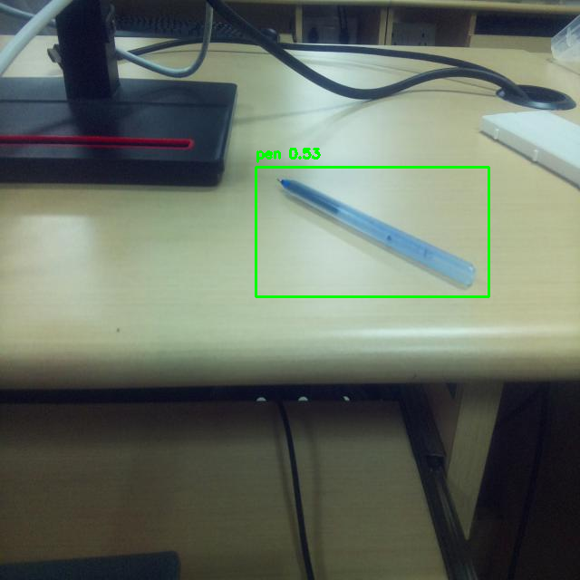
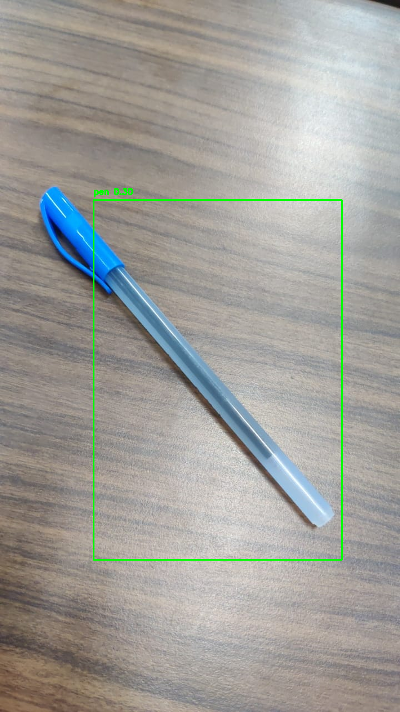
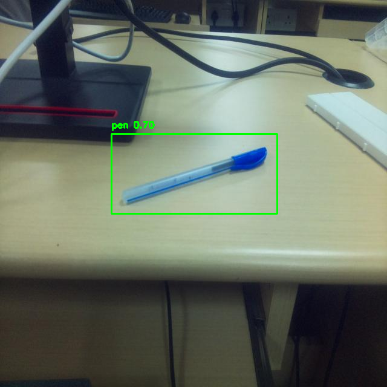

# Cognitive-Robotics-Pen-Detection

## Aim
To build and evaluate an object detection system utilizing the YOLO (You Only Look Once) model for real-time object detection.

## Components
- **Dataset**: Images captured using a Raspberry Pi camera.
- **CNN Model**: YOLO model for object detection.

## Overview
This project leverages the YOLO model for detecting objects in images. The model is trained on a dataset created using a Raspberry Pi camera, capturing images of objects that are then annotated and processed for training.

## Procedure
1. **Image Capture**: Capture images using a Raspberry Pi camera and the `libcamera` module.
2. **Annotation and Dataset Preparation**: Use Roboflow to annotate the images and prepare the dataset.
3. **Model Training**: Utilize the YOLO model to train on the prepared dataset.
4. **Prediction**: Run the model on test images to detect and visualize objects.

## Running the Code
To execute the project, follow the steps outlined in the provided Jupyter notebook. You can also run the notebook in Google Colab for easy access and execution.

## Results
The YOLO model successfully detects objects, and the results are visualized with bounding boxes on images. Here are some examples of the output:

## Conclusion
This project demonstrates the capabilities of the YOLO model for real-time object detection, showcasing its effectiveness in visualizing detected objects with bounding boxes.
